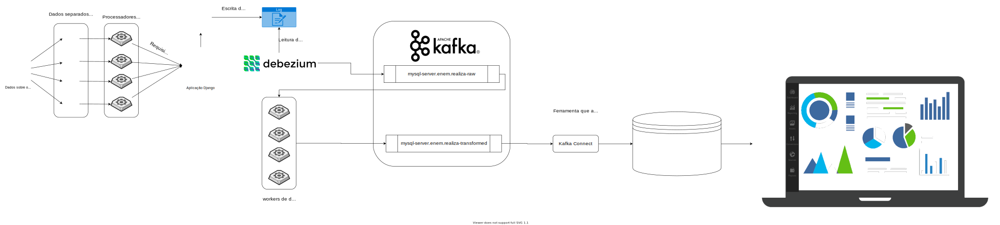

<h1 align="center"> ETL </h1>

## Integrantes do Grupo
| Matrícula  | Aluno                              |
| ---------- | ---------------------------------- |
| 16/0005191 | Durval Carvalho de Souza           |
| 18/0106970 | Matheus Gabriel Alves Rodrigues    |


<div align="justify">

## Sobre o projeto

Nosso projeto possui como tema ETL (Extract Transform Load) e escolhemos
como base de dados os dados para o trabalho final a base do ENEM (2019),
trabalhada pelo membro Matheus Gabriel anteriormente, em que existem
dados referentes ao desempenho de candidatos do exame neste ano, essa
base foi escolhida pelo fato de ser bastante robusta e possuir dados que
possibilitam a criação de consultas e análises por parte dos membros da dupla.
Na parte prática do trabalho foi criada uma pipeline de dados utilizando
debezium, kafka, elasticsearch e kibana; mais explicações na apresentação e
no repositório

<h2 align="center">
  <br>
    <a href="documentacao/etl-bd2.svg">
      
    </a>
  <br>
</h2>

A fonte de dados deste trabalho é um arquivo CSV que contém informações a respeitos dos participantes da prova do ENEM de 2019, assim como suas respectivias cidades de realização, suas notas e informações sobre a prova.

Para realizar a extração primeiramente foi modelado um banco de dados capaz de receber armazenar os dados do CSV de forma normalizada, e depois foi utilizado uma API web para realizar as inserções.

A inserção dos dados era realizadas utilizando um script de leitura de arquivo, onde para cada linha do CSV era realizado várias chamadas para a API populando os dados no banco. Para otimizar a leitura dos dados, o arquivo CSV foi dividido em 4 arquivos e foi utilizado 4 instãncias do worker para realizar a leitura e inserção.

Uma vez que os dados estão no banco de dados, foi utilizado a ferramenta [debezium](https://debezium.io/). Essa ferramenta é capaz de ler os arquivos de logs gerados pelo banco, criar eventos do os dados de inserção e salvá-los no Kafka. A configuração dessa ferramenta foi feita por meio da interface gráfica Kafka Control Center.

Essa forma, uma vez que os dados estão no kafka, a etapa de extração do sistema ETL estava concluída.

A próxima etapa necessária foi a criação de scripts de transformação, responsáveis por ler os eventos do banco de dados, extraír somente os dados relevantes, realizar todos os processos de tratamento de dados e republicá-los no Kafka, agora em um novo tópico.

Uma vez que os dados foram transformados, a etapa de transformação do sistema ETL estava concluída.

A próxima etapa necessária foi a utilização da ferramenta Kafka Connect para carregar os dados de um determinado tópico para o banco de dados ElasticSearch. A configuração dessa ferramenta foi feita por meio da interface gráfica Kafka Control Center.

Uma vez que os dados foram carregados no banco ElasticSearch, a etapa de carregamento do sistema ETL estava concluída.

E por fim, para visualizar os dados foi utilizado o software Kibana, para criar Dashboards, onde foi feito vários gráficos.


## Como executar o projeto

Esse projeto está completamente dockerizado, sendo necessário realizar alguns processos manualmente, por meio de comandos dentro do container.


```bash
# 1. Suba o banco de dados
$ docker-compose up -d mysql

# 2. Suba a aplicação Django
$ docker-compose up -d backend

# 3. Acesse o site e baixe o arquivo `MICRODADOS_ENEM_2019.csv`
# Link: https://www.kaggle.com/saraivaufc/enem-2019

# 4. Mova o arquivo para o diretório: TF_F1_MatheusRodrigues

# 5. Divida o arquivo em vários arquivos. A recomendação é que seja pela quantidade de cores que seu computador tem. O arquivo possui 5095271, logo basta dividir esse valor pela quantidade de cores e usar o script sliter.py passando como parâmetro o arquivo e a quantidade de linhas. Lembre-se de adicionar a linha de cabeçalho do CSV no início de cada arquivo (exceto o primeiro, que já terá cabeçalho).

# 6. Entre do container da aplicação Django
$ docker-compose exec backend bash

# 7. Execute os leitores de arquivos utilizado os arquivos criados
$ python http_populate.py MICRODADOS_ENEM_2019_PART_1.csv
$ python http_populate.py MICRODADOS_ENEM_2019_PART_2.csv
$ python http_populate.py MICRODADOS_ENEM_2019_PART_3.csv
$ python http_populate.py MICRODADOS_ENEM_2019_PART_4.csv

# 8. Espere a leitura dos arquivos ser concluída

# 9. Suba o kafka, control-center e o kafka-connect. Espere entre 5m ~ 10m entre a execução dos comandos abaixo
$ docker-compose up -d zookeeper
$ docker-compose up -d kafka
$ docker-compose up -d control-center
$ docker-compose up -d kafka-connect

# 10. Crie um tópico onde os dados do banco serão carregados. Para isso entre no container do kafka e crie um tópico com a quantidade de partições igual ao número de cores que sua máquina possui.
$ docker-compose exec kafka bash
$ kafka-topics.sh --zookeeper 0.0.0.0:2181 --create --topic mysql-server.django_enem.enem_realiza --partitions 4 --replication-factor 1


# 11. Entre no Kafka Control Center, usando a porta 0.0.0.0:8083, e carregue o arquivo do connector do mysql (connector_mysql-connector_config.properties). Para isso clique na Aba `Connect` na barra lateral, clique em adicionar um novo conector, clique em utilizar um arquivo, e selecione o arquivo connector_mysql-connector_config.properties. Confirme a criação

# 12. Espere os logs serem lidos pelo Debezium, esse processo pode demorar horas dependendo do seu hardware. A leitura dos logs é uma rotina sem fim, sempre que algum dados é inserido no banco o worker do Debezium irá ler os logs e inserir eventos no kafka. É possível acompanhar esse processo lendo os logos do container kafka-connect
$ docker-compose logs -f kafka-connect

# 13. Uma vez que os dados do banco foram lidos e salvos no tópico, execute os workers de transformação. Mas antes de executá-los, modifique no arquivo docker-compose.yml, o valor de services.worker.deploy.replicas com o número de cores que sua máquina possui. Não é necessário esperar os workers finalizarem sua execução, uma vez que esses workers estão sempre em execução. É possível acompanhar seu processamento por meio de seus logs de execução.

$ docker-compose up -f workers
$ docker-compose logs -f workers

# 14. Suba o Elastic Search e o Kibana
$ docker-compose up -f elasticsearch
$ docker-compose up -f kibana

# 15. Entre no Kafka Controle Center, usando a porta 0.0.0.0:8083 e configure o Kafka Connect. Para isso clique na Aba `Connect` na barra lateral, clique em adicionar um novo conector, clique em utilizar um arquivo, e selecione o arquivo `es-skink.properties`. Confirme a execução. A execução do Kafka Connect é um processo sem fim, sempre que um dado for transformado, o dado será carregado no ElasticSearch.

# 16. Acesse o kibana utilizado a porta 0.0.0.0:5601 e acessa a aba de Dashboard. Quando a página carregar será mostrado um pop-up pedindo para criar um índice. Clique no pop-up e crie um índice. Volte para a aba do dashboard e crie os gráficos desejados com os dados já carregados no elasticsearch.
```

</div>